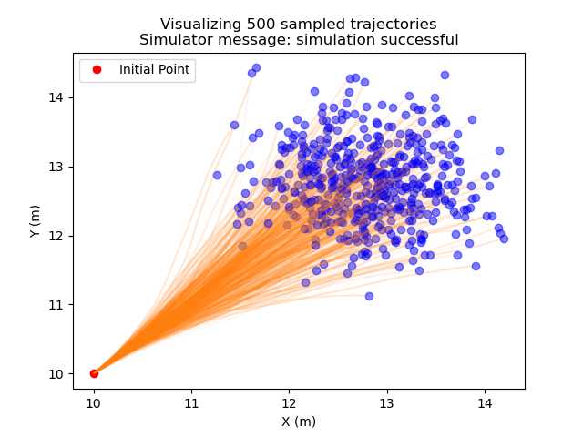

# FSC CUDA Studies

## Prerequisites

* CMake (3.24+)

    This is highly experimental code, so a very late CMake is expected.

    Follow [this guide](https://askubuntu.com/questions/355565/how-do-i-install-the-latest-version-of-cmake-from-the-command-line) to install the latest CMake from standard repositories.

* ninja-build

    Ninja is known to be faster than Unix make.
    Install with `sudo apt-get install ninja-build`

* ccache

    Caches previous compilations to speed up compiling as much as possible

## Building

We strongly recommending using the provided CMake preset.
If you are using vscode, the CMake extension will choose the correct preset **Linux X64 Default** (instead of using compiler kits).
If you are building from the command line, run

``` bash
cmake -S . --preset=linux-default # NO -B build option
cmake --build --preset=build-debug # Or build-release
```

## Running

A rich example of integrating an ensemble of dynamical systems is provided with plot output. Run

``` bash
./build/out/examples/Release/run_simulation
```

> :exclamation: This examples calls up to python to do matplotlib plotting.
> Ensure you have matplotlib and numpy installed, and you are building and running the code under ths **SAME** python environment.



## Testing

Two rudimentary tests are provided. Reading these tests is educational.

* `test_basic_kernel_launch.cu` fleshes out the parallel matrix addition example in the [CUDA programming model article](https://developer.nvidia.com/blog/cuda-refresher-cuda-programming-model/), adding correct input/output argument setup
* `test_function_pointer.cu` is inspired by the [Pass Function Pointers to Kernels CUDA](https://leimao.github.io/blog/Pass-Function-Pointers-to-Kernels-CUDA/) article but simplified, minimally demonstrating the difficult task of passing functions to kernels.

If you are using vscode, the CMake extension will help you choose the correct preset **Run GTest unit tests** then **Run CTest** button will correctly run all tests.

If you are testing from the command line, run

``` bash
ctest --preset=test-gtest
```
